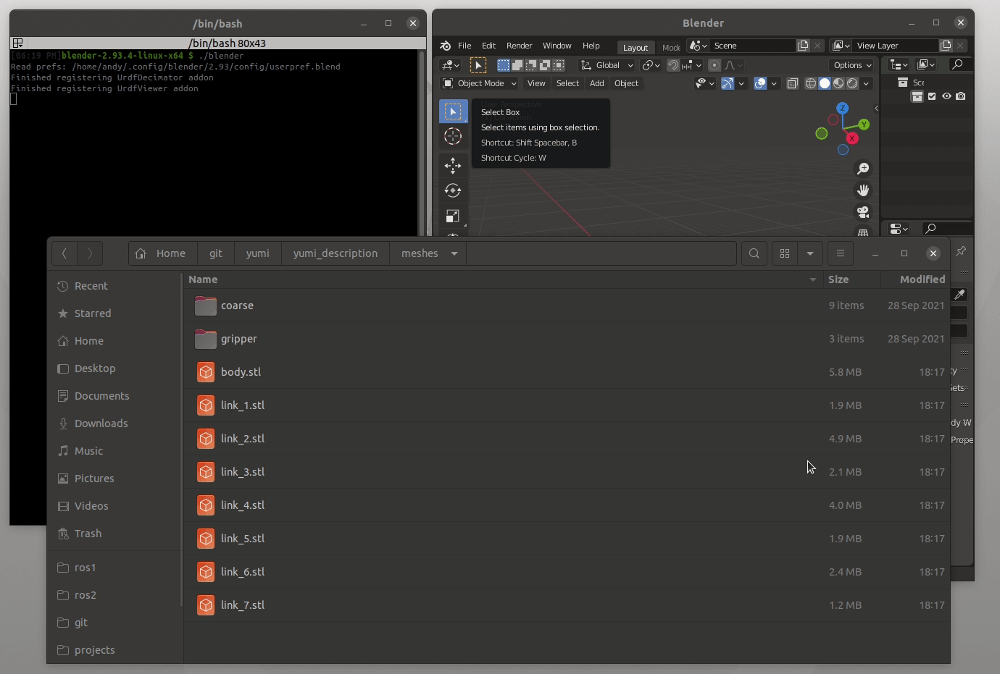
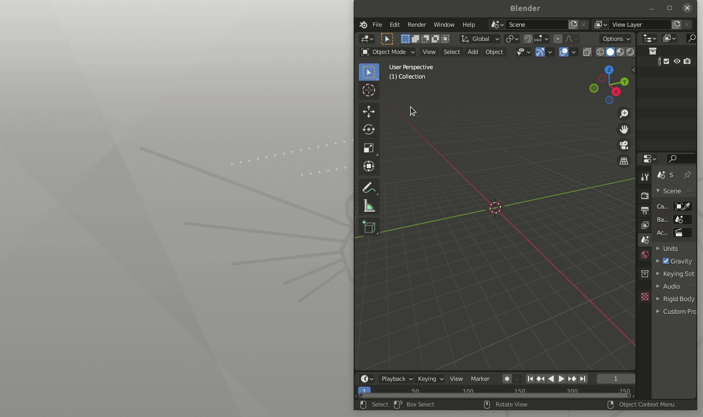

# Blender URDF Viewer

v0.1.3

Tested with Blender v2.90.1, v2.93.4

Available Add-ons:
- URDF visualizer
- Batch mesh decimator

Often when I'm generating URDFs from SolidWorks I need a visualizer where I can move joints and links around and also do things like decimate the meshes so they are a reasonable file size. This is a collection of those Blender scripts that I've found helpful while creating and working with URDF packages.

## URDF Visualizer


### Current Limitations

- Only Fixed, Revolute, Continuous, and Prismatic joint types.
- Doesn't handle primitives. Assumes you're working with generated mesh files.
- Cannot save configuration.
- Cannot load URDFs that have models in different packages.

## Mesh Decimator

This does not produce any visual results, but allows you to select a directory of meshes and specify the maxium size that you'd like each mesh to be. The script will then automatically look for STL files, reduce their size if necessary, and re-export to get rid of the `SOLID` warning Rviz throws for STLs generated with SolidWorks.

Backups of all files are created (using a `*.1`, `*.2`, etc) modifier to the filename.



### Current Limitations

 - Does not ask if you want to apply the decimation, all models above the size limit are decimated.
 - Only works on STLs.

## Blender Addon Setup

### For Linux

Create a symlink to the add-ons you wish to use in your local config:

```
cd ~/.config/blender/2.93/scripts/addons
ln -s ~/git/blender_urdf_visualizer/viewer blender_urdf_visualizer
ln -s ~/git/blender_urdf_visualizer/decimator blender_urdf_decimator
```

### For Windows

Download the Windows Portable (.zip) version of Blender. Then

1. Unzip Blender in the location you choose.
1. Navigate to `<blender_folder>/2.90/scripts/addons_contrib`.
1. Clone this repo into this directory.

### Enable the Addon

To enable the Add-on in Blender:

1. Open Blender
1. Navigate to `Edit > Preferences`
1. Select `Add-ons > Testing`
1. Enable `Object: URDF`

**NOTES:**
1. During development, you may need to disable the Add-on and re-enable it for it to load properly.
2. To see all of the output from the console, launch blender from the command line.


