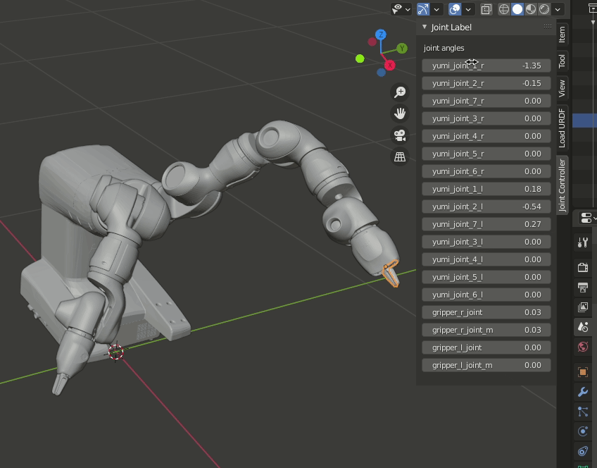

# Blender URDF Viewer

v0.1.1

Tested with Blender v2.90.1, v2.93.4

Often when I'm generating URDFs from SolidWorks I need a visualizer where I can move joints and links around and also do things like decimate the meshes so they are a reasonable file size. This is a collection of those Blender scripts that I've found helpful while creating and working with URDF packages.



## Current Limitations

- Only Fixed, Revolute, Continuous, and Prismatic joint types.
- Doesn't handle primitives. Assumes you're working with generated mesh files.
- Cannot reload or load a new URDF.
- Cannot save configuration.
- Cannot load URDFs that have models in different packages.

**NOTES:**
1. During development, you may need to disable the Add-on and re-enable it for it to load properly.
1. To see all of the output from the console, launch blender from the command line.

## Blender Addon Setup

### For Linux

Create a symlink to this repository in your local config:

```
cd ~/.config/blender/2.90/scripts/addons
ln -s ~/git/blender_urdf_visualizer blender_urdf_visualizer
```

### For Windows

Download the Windows Portable (.zip) version of Blender. Then

1. Unzip Blender in the location you choose.
1. Navigate to `<blender_folder>/2.90/scripts/addons_contrib`.
1. Clone this repo into this directory.

### Enable the Addon

To enable the Add-on in Blender:

1. Open Blender
1. Navigate to `Edit > Preferences`
1. Select `Add-ons > Testing`
1. Enable `Object: URDF`
